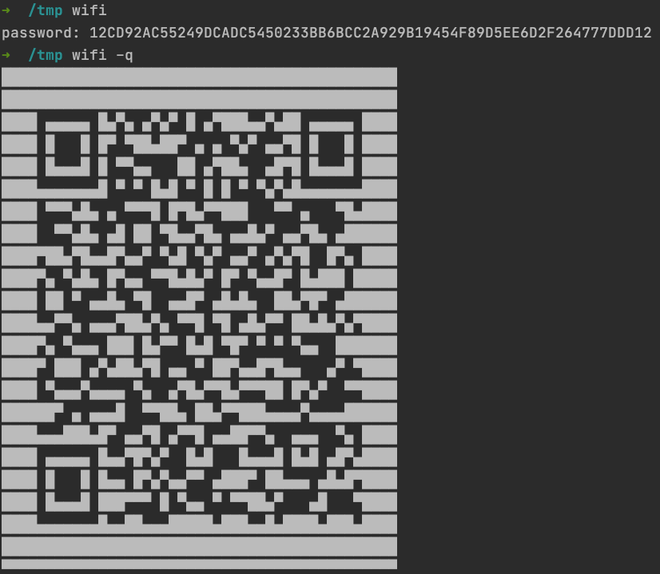

<p align="center">
  <p align="center">
    <b>wifi</b>
  </p>
  <p align="center">Quickly fetch your WiFi password and if needed, generate a QR code of your WiFi to allow phones to easily connect.</p>

  <p align="center">
    
    
    
  </p>
</p>


## Demo



## Installation
Deno ships as a single executable with no dependencies. You can install it using the installers below, or download a release binary from the [releases page](https://github.com/xjh22222228/python-check-updates/releases).

Shell (Mac):
```
curl -fsSL https://raw.githubusercontent.com/xjh22222228/wifi/main/install.sh | bash
```


## Options

```
-q, --qrcode           Print Qrcode
-i, --image            Generate QR code image
-v, --version          Output the version number
-p, --password         Print Password
-s, --ssid             Specify a SSID that you have previously connected to
```

## Example
```
$ wifi

$ wifi -q
```
